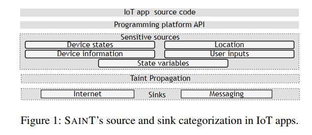
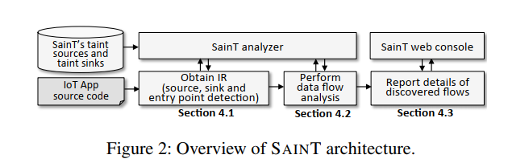
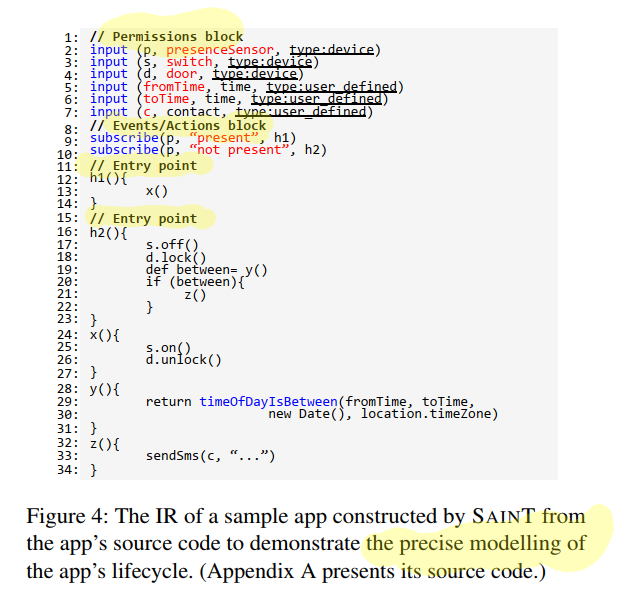
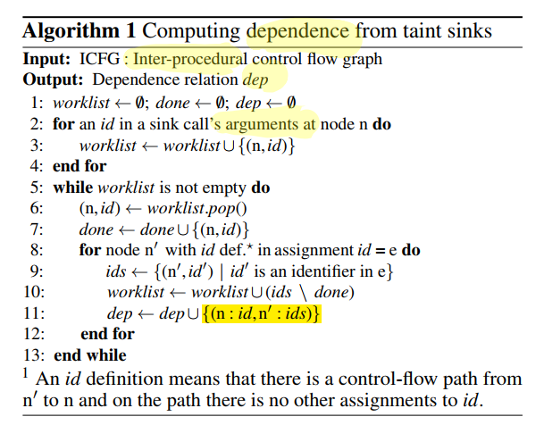
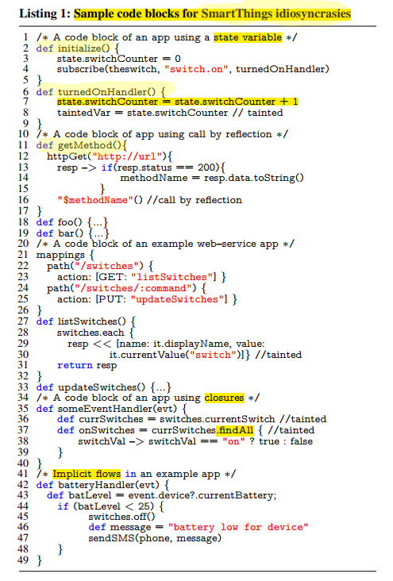

<https://www.usenix.org/conference/usenixsecurity18/presentation/celik>

# Sensitive Information Tracking in Commodity IoT 

该文章提出了 SAINT，IoT应用的静态污点分析工具，使用了app间和 app内数据流分析进自动信息流跟踪。之后在 230 SmartThings apps 中评估工具。结果：flagged 92 out of 168 official and 46 out of 62
third-party apps ，并使用 IoTBench 提供的测试集进行验证，结果：25 out of 27 unique leaks in the 19 apps. 

## intro

目前 IoT 的应用隐私是很大的问题，但是各大平台缺少基本的工具和服务来分析app中的信息使用。SmartThingss,OpenHAB, Apple's HomeKit 提供了 guidelines 和 policies 来规范安全性。相关市场在app分发前提供 internal vetting 。但目前缺少分析IoT实现中的隐私risk 的工具。

**SAINT** 该文章提出了 SAINT, 静态污点分析工具。通过追踪敏感源的信息流查找敏感数据流。文章通过的调查三大主流平台，识别 IoT-specific 源和汇以及 sensor-computation-actuator 。然后将IoT app 的 source code 转化成 IR,描绘 app 的 lifecycle。包括 entry points, user inputs, and sensor states. 基于此，识别IoT-specific events/actions 和异步执行事件。还有platform-specific  challenges 比如 call by reflection 和 the use of state variables 。SANIT 使用IR执行有效的静态分析来追踪从敏感源到汇的信息流。

**Study:**

分为两部分。

1. horizontal market study  

   数据：230 SmartThings IoT apps, including 168 market vetted (called official) and 62 non-vetted (called third-party) apps 

   结果：flagged 92 out of 168 official and 46 out of 62
   third-party apps 至少包含一个通过 internet 或 message service 的敏感数据片段。

   此外，实验表明被分析的apps有一半传输至少三种敏感数据源，如device info, device state, user input)。

2. IOTBENCH 

   1. 结果：25 out of 27 unique leaks in the 19 apps. ，有两个误报。原因：flow over-approximation
      resulting from reflective methods calls另外两个 miss 原因：包含side-channel leaks ，超出 SAINT 分析的范围。

3. 上下文问题

   代码分析只识别 potential flows of sensitive data ，没有分析用户行为。而flow与上下文是十分相关的。因此实验中识别潜在影响用户或环境安全性和隐私的数据流。

## Problem Scope and Attacker Model 

### Problem Scope 

SAINT 对app的源码进行静态污点分析（常用的思路），没有界定数据泄露是恶意的还是dangerous. 但是可以使用其输出进一步分析app的功能性并通知用户潜在的隐私风险。

关注 home automation platforms ，分析 SmartThings  中的 apps.有两个原因：

1. 支持大量设备并提供丰富的app功能
2. 详细公开文档

其他语言支持应该也不错，因为  SAINT 从源码中获取 abstract intermediate representation  进行分析的。

## Attacker Model 

文章假设攻击者不能绕过 IoT 平台的安全措施

## Background

### Information Tracking in IoT Apps 

存在的问题以及该文章的解决方法

1. 平台多样性，没有统一的编程语言，文章：propose a
   novel IR that captures the event-driven nature of IoT apps; 
2. 很多污点追踪系统需要配置污点源和汇，识别 apps 的 taint 和 sink 十分不稳定，因为它们访问多种设备，每种有不同的内部状态。文章：描述IoT平台中常见的污点源和汇
3. 每个平台都有idiosyncrasies ，为污点追踪带来挑战。如 SmartThings 的 callbyreflection

## IoT Application Structure 

主要说明常见的污点源和汇 ,看图

污点源

污点传播：在事件处理器执行时，追踪敏感信息是如何在 app 中传播的。

污点汇

## SAINT

模型主要分三步：

1. 转化为 IR
2. 描述 app 的生命周期并执行静态污点分析
3. 报告敏感信息流

### From Source Code to IR 

使用framework-agnostic  组件模型，包含IoT的构建块。

三部分

1. Permissions  
2. Events/Actions  
3. Call graphs 

例子：

### Static Taint Tracking 

### backward

回溯，减少overhead

回溯确定依赖的算法：

### SmartThings Idiosyncrasies 

例子包含了各个特性：

#### Field-sensitive Taint Tracking of State Variables 

SmartThings 中 ，状态变量存储在全局 state 对象或全局 atomicState 对象。

使用 “state variable”  标记在state 和 atomicState 的字段。

#### Call by Reflection

如果攻击者可以控制 call by reflection 的字符串就可以进行漏洞利用。

SAINT 在进行调用图构建时，尽可能添加所有可能的调用目标。这是一个 safe over-approximation 

#### Web-service Applications 

作者人工调查发现相应 HTTP 外部链接请求的 web 服务应用可能会泄露敏感数据。作者分析通过mappings 声明的回调方法，标记通过这些方法泄露的敏感数据。

#### Closures and Groovy-Specific Operations 

app 中，通常使用闭包遍历对象列表。SAINT 分析闭包的结构和审查表达式，查看污点是如何传播的。

#### 隐式流

污点接口的调用控制取决于条件分支中的敏感信息。

SAINT 检查条件分支中的条件查看它是否依赖某一污点值。如果是，会标记所有条件分支中的元素。SAINT 中检查隐式流是可选的。

### Implementation 

IR 的构建需要app 的ICFG （过程间控制流图）的构建。直接在Groovy 代码的抽象语法树进行工作。SAINT  在编译的语义分析阶段访问 AST 节点，使用 ASTTransformation  进行 hook，使用GroovyClassVisitor  提取入口点和app 的结构。GroovyCodeVisitor   提取AST 中的函数调用和表达式。

## 个人总结

贡献：主要提出用于app 静态分析工具 SAINT，用于发现app中的敏感信息泄露。

有一个很大的前提，要有源码。目前只支持 SmartThings 中使用 Groovy 编写的，不清楚其他平台的apps 效果怎么样。不过看分析说转化为 IR，所以总体结构没大差别。但需要解决不同平台的特性。 分析的范围有限。没有考虑用户行为或其他环境。