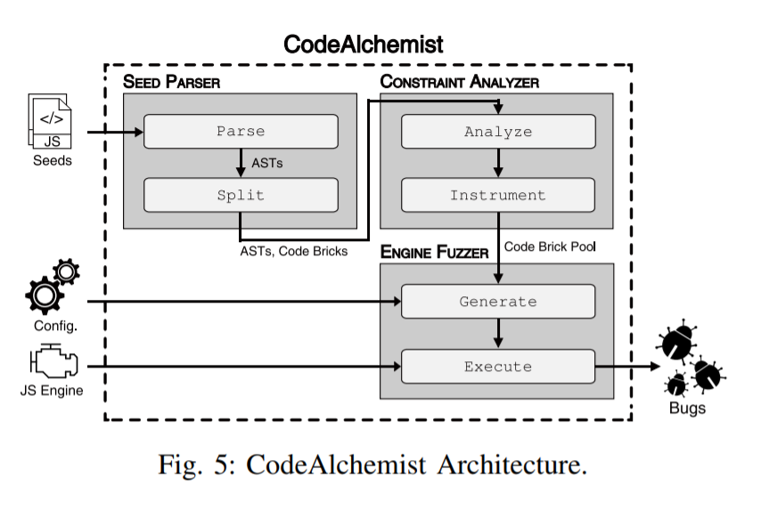
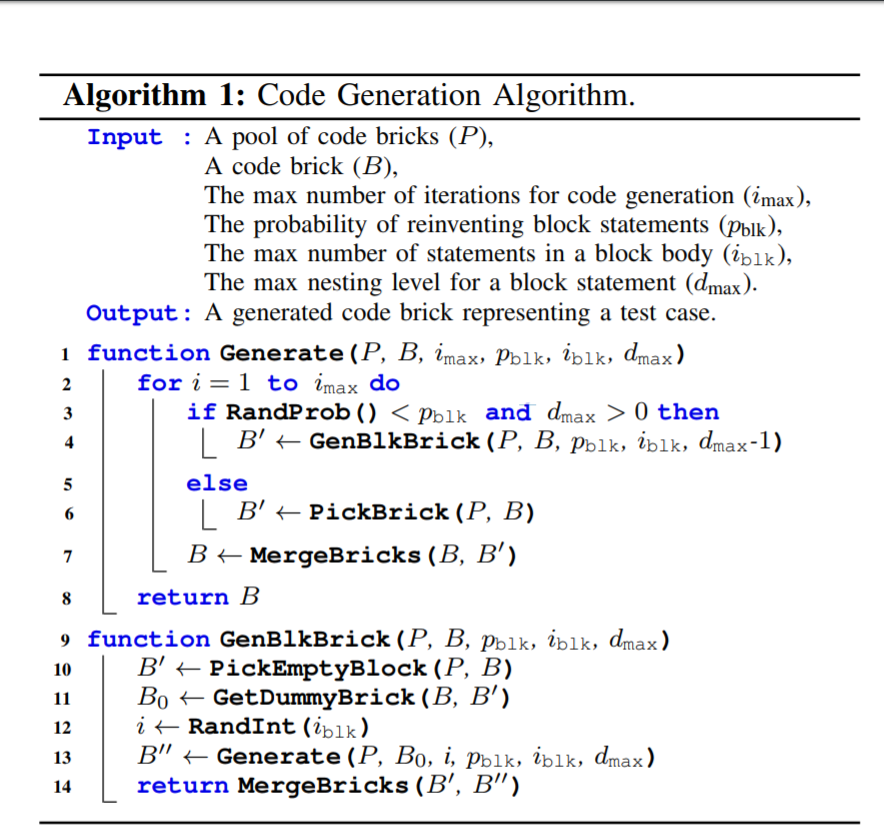
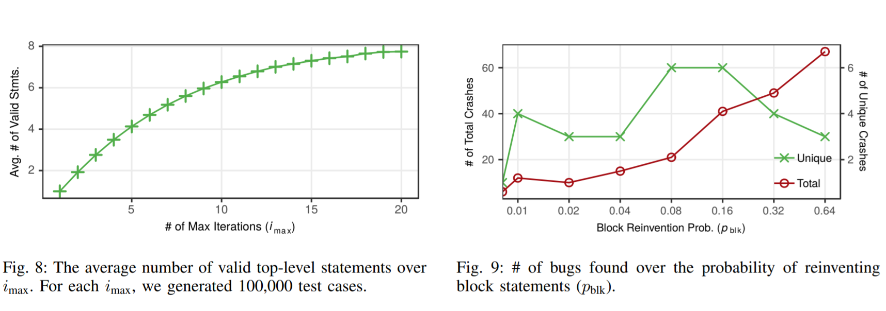
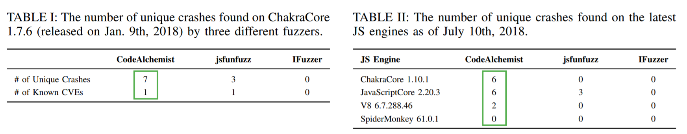
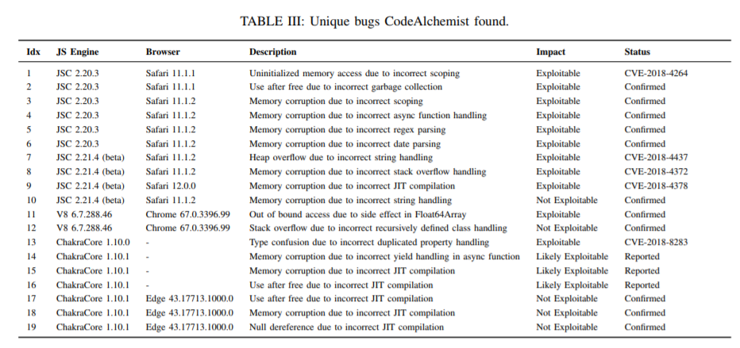

# codeAlchemist: Semantics-Aware Code Generation to Find Vulnerabilities in JavaScript Engines

## overview

目前针对 JS 引擎的fuzzer 通常基于预定义的 context-free 或训练的概率语言模型来生成语法正确的用例，但是这在运行时语义通常是无效的，此外，JS是动态的，所以静态语义分析不可行。在该文章中，提出了新的用例生成算法，并实现了 CodeAlchemist, 该工具可以生成语法和语义正确的用例，已经发现了一些漏洞并报厂商。

## introduction

目前已有很多针对JS引擎漏洞挖掘的工具，如LangFuzz,  将 seed 分成不同的代码段，然后重新组合这些片段生成 样例。jsfunfuzz, 不需要样本种子，根据编写的JS语法随机生成语法正确的 statements.

而当前主流的 JS 引擎 fuzzer 都存在语义错误的问题。根据文章的测试，99% jsfunfuzz 生成的样例都有运行时错误，而 langFuzz 生成用例时没有考虑语义，所以或多或少都会有这个问题。如生成的用例可能使用了但在上下文中没有定义的 变量。

jsfunfuzz 理论上可以通过完整的语法可以解决这个问题，但是这相当于编写一个 JS引擎，不太实际。jsfunfuzz 通过 try/catch 使错误安静抛出。

Skyfire 和 TreeFuzz 通过建立概率语言模型部分学习了 JS 的语义，但是极大程度上依赖于语言模型的准确率，目前很难处理 JS  的复杂类型系统，因此还是很可能生成语义错误的测试用例，如  x.toUpperCase()，这里 x 如果不是字符串则会有类型错误。

该文章提出了新的用例生成技巧，semantics-aware assembly,可以自动生成语法和语义正确的用例。

核心是将 JS seed 分成各个片段，称为 code bricks, 每个 code brick 都有相应的约束，表明在什么情况下可以和其他 code brick 组合。称为 assembly constraint. 使用传统的数据流分析，识别每个 code brick 使用和定义的变量，再通过动态分析识别它们的类型。只有当code brick使用的变量在其他code brick 中预先定义并且类型一致才会合并它们。不像 LangFuzz 只要符合语法就会随机合并代码片段。实验表明，该技术极大减少了语义错误的用例。

主要贡献：

- semantics-aware assembly
- 实验原型 CodeAlchemist
- bugs found

## motivtion

测试 jsfunfuzz ,发现评价78.7% 和 17.7%的js 文件有引用错误和语法错误。许多没有动态修改的 js 文件也有语法错误，理论上对于 grammar-based 的fuzzer是不应该的。而因为 jsfunfuzz 具有人工编写的语法规则，可能包含错误或不完整的生成规则。而这也说明了编写 fuzzer 语法的难度。

因此，该文章的目标是**无需人工编写的语法，自动的生成 js 测试用例，并且最小化运行时错误。**

另外还发现 jsfunfuzz 生成的 top-level statements，只有一小部分在运行时是有效的。

## 技术方案

### Sematics-aware Assembly

将代码分成可以组合的 code brick, 每一个表示有效的抽象语法树。

每个包含 assembly constraint, 在组合 code bricks 需要符合这些约束。

postcondition：描述在该 code brick 有哪些变量可用

需要解决的困难

- how to break into code bricks
- maintain a pool of code bricks, 最小化 size 同时保留语义
- rename symbols
- data dependencies to get constraints
- infer types of  变量
- combine code bricks with assembly constraints

### CodeAlchemist Architecuture

输入：seeds、config、JS Engine

输出：bugs

主要部分：

- SEED PARSER

  将 seed 分成 code bricks 集：

  Parse: 先将 seed 解析成 AST 

  Split: 将 AST 分成 code bricks 并标准化，每一个 code brick 都是一个有效的 AST

- CONSTRAINT ANALYZER

  推断每个 code bricks 的 assembly constraint 并进行标注

  Analyze 使用数据流分析识别 used 和 defined 的符号

  Instrument 动态 instrument code bricks, 记录变量的类型

  最后获得 code brick pool

- ENGINE FUZZER

  从  pool 中选择 code bricks 进行组合，生成测试样例并执行

  Generate: 基于 assembly constraints 不断组合 code bricks 生成样例，可以接受用户配置的参数，调整组合的方式

  Execute: 在 JS 引擎执行用例，如果 crash,记录对应的测试用例

### Running Example 

用实际例子说明如何执行

## 设计和实现

### Seed fragmentization

有两种方法：

- 采用 LangFuzz 中的方法，将 AST 分成子树，其中每个非终结结点作为子树的 root. 但会有很多重叠
- 在 JS 表达式层切分，必然是个有效的 AST, 与第一种方法对比切分数更少，但是没有捕获 high-level 的结构

本文采用了第二种方法

### Code brick pool

- 去除重复，如果 AST 相同但符号不同，也会视为重复。

- 过滤无关的、阻碍 Fuzz 的代码、如SpiderMoney 中的crash 函数
- 执行 eval 函数，因为该原型无法推断动态生成的代码的 assembly constraints, 而eval 可能会导致运行时错误。(注：因为会修改类型)
- 删除等价noop 的 code bricks

### Rename

在保留语义的同时同命名变量。

在两种情况重命名：

1. 去除重复时
2. 组合code bricks时

解决预定义符号问题： 在启动时执行 JS engine 获取内置对象列表，重命名时不包括这些名字

### 数据流分析

该分析是path-insensitive 的，可能会出现错误，比如if true 才定义一个变量 x，false 不会定义。而它会视为都定义。

path-sensitive 准确率可能会好一些。

### 类型分析

问题：over-approximate ,比如都视为 Object, 很容易导致运行时错误  

解决：建立自己的类型系统，包含7中主要类型以及 Object 的子类型，区分了 Object 和 Array

动态推断类型。使用 log.

### Code Brick组合

接受四个用户配置的参数，本文章只关注前两个参数

- 生成算法的最大迭代数 

- 重新生成块的概率 . 
- 生成 block statement 的最大迭代数 
- 组合block statement 的最大嵌套级

## 评估

#### setup

测试的引擎：

(1) ChakraCore 1.10.1; (2) V8 6.7.288.46;
(3) JavaScriptCore 2.20.3; (4) SpiderMonkey 61.0.1.

**种子收集**：

1. 这四个引擎的 regression tests
2. Test262

还有 169 个收集的可触发已知安全漏洞的PoC.

**Code  Brick Pool:**经过一系列处理，最终获得 49800 个 code bricks

主要从以下几个方面对实验进行评估：

#### 是否生成语义有效的用例

与 jsfunfuzz 对比，总体上语义有效的样例是它的6.8倍, 如果没有 constraint, 效果也会差，表明了 assembly constraint 的重要性。

#### 参数对于CodeAlchemist 的影响

- 与前沿 fuzzer 对比的效果，在漏洞挖掘方面

  

#### 是否可以在最新的 JS 引擎中发现真实漏洞

发现19个bugs,其中11个未知，已报厂商并获得3个 CVE

#### 发现的漏洞 长什么样

## 讨论与局限

### seed selection

原型从已有的测试集获取seed，采取前沿的种子选择策略，自动化种子选择技术如Skyfire 可能有助于模型。

### code brick selection

目前随机选择，本文章遵循完全黑盒的方法，同 LangFuzz, 可以采取灰盒的方式。还可以使用概率语言模型选择。

### supporting other targets

在C/C++强类型语言中效果可能更好，无需动态推断类型，同时在JS bindings 中进行测试如 Node.js 和 PDF 阅读器。